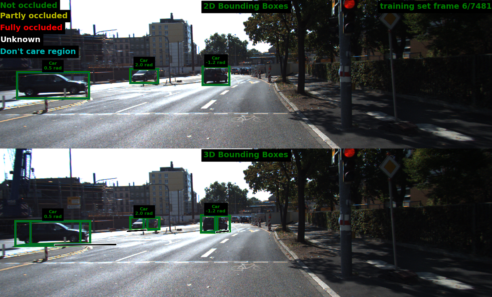
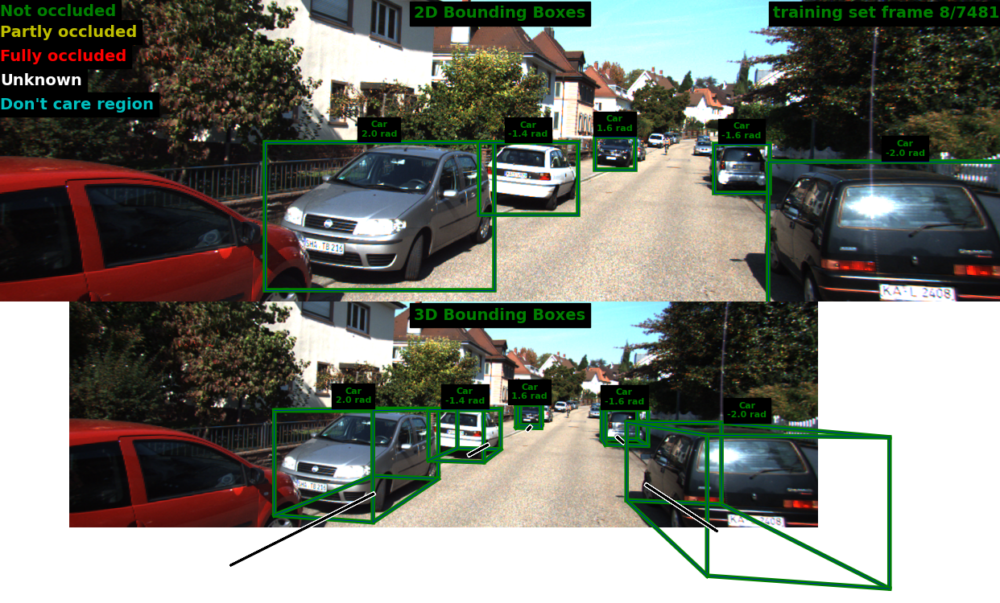
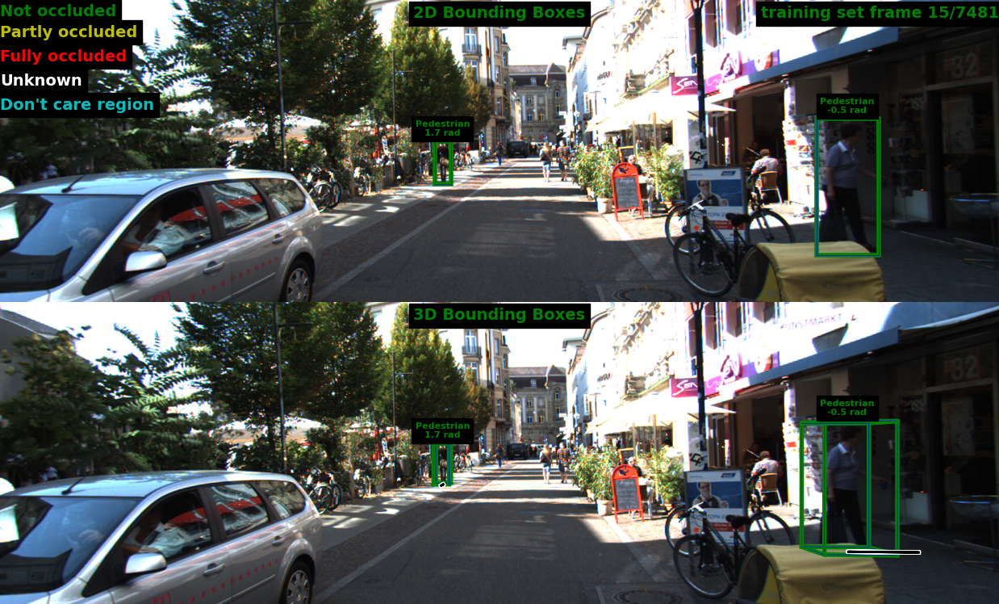

# README

## KITTI Dataset

This code helps visualize KITTI 3D object detection results based on KITTI DevKit. Data could be downloaded from [official website](http://www.cvlibs.net/datasets/kitti/eval_object.php?obj_benchmark=3d) and organized as follows:

```
<kitti-dataset-root>
|--training
  |--calib
    |--000000.txt
    |--000001.txt
    |--...
  |--image_2
    |--000000.png
    |--000001.png
    |--...
  |--label_2
    |--000000.txt
    |--000001.txt
    |--...
  |--pred_2
    |--000000.txt
    |--000001.txt
    |--...
|--testing
  |--calib
    |--000000.txt
    |--000001.txt
    |--...
  |--image_2
    |--000000.png
    |--000001.png
    |--...
```

Place predictions in /pred_2 folder to see results.

## Installation

Dependencies

```
python == 3.8.10
matplotlib==3.5.2
numpy==1.23.0
pandas==1.4.3
Pillow==9.2.0
tqdm==4.64.0
```

Clone this repository

```bash
git clone git@github.com:QQQQ00243/KITTI-3D-Object-Visualization.git
cd KITTI-3D-Object-Visualization
```

Run

```bash
python run_demo.py --root-dir <root-of-dataset> --dataset <train-or-test> --output-dir <directory-to-save-plots> --pred <see-predictions>
```

By default, a folder named `outputs` will be created, where .png file with same index as its corresponding label file will be saved.

## Demonstration of Results

Below are the results for [GUPNet (Geometry Uncertainty Projection Network for Monocular 3D Object Detection)](https://github.com/SuperMHP/GUPNet). 





